# Octave Game Engine Connector — Blender Addon

Bridge between Blender and the Octave Engine for scene export with per-object metadata.

## Installation

1. Download the zip file from the Releases area of this repo.
2. Open Blender (4.0+)
3. Go to **Edit > Preferences > Add-ons > Install**
4. Navigate to the downloaded `octave-gameengine-connect.zip` and install it.
5. Enable **"Octave Game Engine Connector"** in the add-ons list if it isn't automatically.

## Getting Started

1. Open the **N-panel** in the 3D Viewport (press `N`)
2. Select the **OctaveEngine** tab
3. Set the **Project Dir** to the root of your Octave project (the folder containing `Assets/` and `Scripts/`)
4. The addon automatically scans the project and shows a status line: `Assets: N | Scripts: N`
   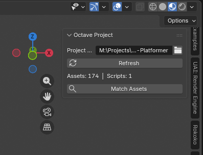

That's it — you're ready to assign assets, scripts, and metadata to your objects and export.

### Scanning

When you set or change the **Project Dir**, the addon scans for `.oct` asset files and `.lua` scripts automatically. It searches:

- `Assets/` and `Packages/` for `.oct` files
- `Scripts/` and `Packages/*/Scripts/` for `.lua` files

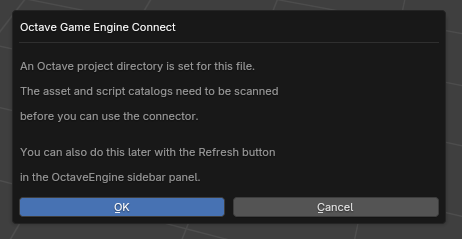

Click **Refresh** at any time to rescan the project (e.g. after adding new assets or scripts on disk).

When you open a `.blend` file that already has a project directory set, the addon clears any stale catalog data from the previous session and prompts you to rescan. You can scan immediately from the prompt or dismiss it and click **Refresh** later.

## Per-Object Properties

Select any object and open **Properties > Object > Octave Data** to configure how it will be imported into the Octave Editor.
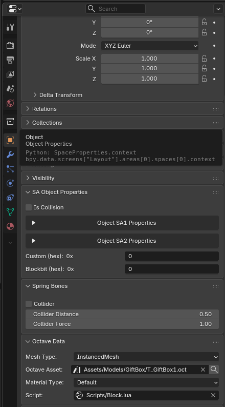
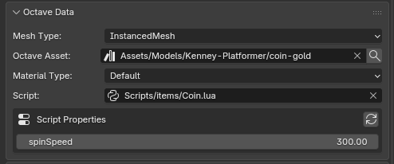

### Mesh Type

Dropdown controlling the node type created on import (meshes only):

| Value                   | Description                                                |
| ----------------------- | ---------------------------------------------------------- |
| **Node3D**        | Plain transform node — no mesh is assigned                |
| **StaticMesh**    | Standard mesh node (default) — creates a `StaticMesh3D` |
| **InstancedMesh** | GPU-instanced mesh node — creates an `InstancedMesh3D`  |

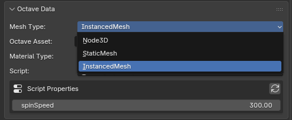

### Octave Asset

Search field to link an existing project asset by its project-relative path (e.g. `Assets/Meshes/SM_Cube`). When set, the Editor resolves the asset by UUID first, then by name, falling back to the embedded glTF mesh.

A magnifying-glass button next to the field auto-matches the asset based on the object name (see [Match Asset](#match-asset) below).
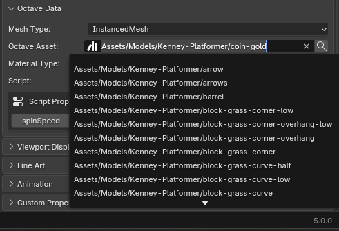

### Material Type

Dropdown for the material shading type on import. Only applies when no Octave Asset is set:

| Value                  | Description                  |
| ---------------------- | ---------------------------- |
| **Default**      | Use the scene import default |
| **Unlit**        | Unlit material (no lighting) |
| **Lit**          | Standard lit material        |
| **Vertex Color** | Use vertex colors            |

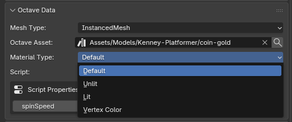

### Script

Search field to attach a Lua script to the node. Scripts are shown as project-relative paths (e.g. `Scripts/Player.lua`).

When a script with a `GatherProperties()` function is assigned, the addon parses it and displays editable **Script Properties** below the field. These let you set per-object property overrides (integers, floats, bools, strings, vectors, colors, and asset references) directly in Blender. The values are embedded in the export and applied by the Editor on import.

Click the refresh icon next to "Script Properties" to re-parse the script after editing it on disk.
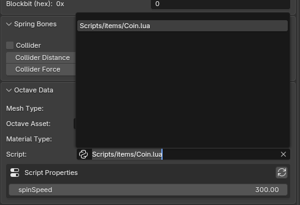

### Main Camera (cameras only)

Boolean toggle shown when a Camera object is selected. When enabled, the exported camera node is flagged so the Editor sets it as the active camera on import.
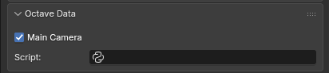

## Match Asset

The addon can automatically match Octave assets to Blender objects based on their names.

### Single Object

In **Properties > Object > Octave Data**, click the magnifying-glass icon next to the **Octave Asset** field. The addon matches the active object's name against the asset catalog and fills in the field.
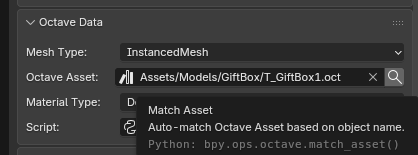

### Bulk Match

In the **3D Viewport > Sidebar > OctaveEngine** tab, click **Match Assets** to auto-match all selected objects at once. Camera objects are skipped. A report shows how many objects were matched.
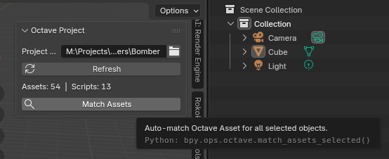

### Matching Algorithm

Blender duplicate suffixes (`.001`, `.002`, etc.) are stripped before matching. The matcher compares the object name against the leaf name of each catalog entry (e.g. `SM_Cube` from `Assets/Models/SM_Cube`) with the following priority:

1. **Exact match** — `SM_Cube` == `SM_Cube`
2. **Case-insensitive exact** — `sm_cube` == `SM_Cube`
3. **Object name is substring of asset** — `Cube` found in `SM_Cube`
4. **Asset name is substring of object** — `SM` found in `SM_Cube_Large`

The first exact match wins immediately; otherwise the best fuzzy match is used.

## Exporting

1. Go to **File > Export > Octave Engine Scene (.glb)**
2. Choose the output path and click **Export**

Export options:

- **Selected Only** — export only selected objects instead of the full scene
- **Apply Modifiers** — apply modifiers before exporting (enabled by default)

The addon syncs all Octave properties to Blender custom properties, then invokes the glTF exporter with `export_extras=True` to embed the metadata into each node's `extras` block. The scene is exported as a single `.glb` binary file.

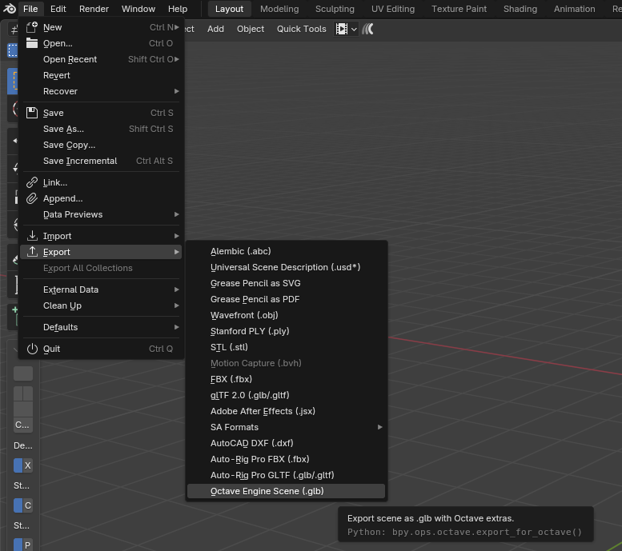


### Script Path Remapping

Script paths are remapped on export to match what the engine expects:

- `Scripts/Player.lua` becomes `Player.lua` (the engine prepends `Scripts/` automatically)
- `Packages/Addon/Scripts/AI/Enemy.lua` becomes `Packages/Addon/AI/Enemy.lua`

## GLB Extras Format

Each node in the exported GLB file may contain an `extras` object:

```json
{
  "mesh_type": "StaticMesh",
  "octave_asset": "Assets/Meshes/SM_Cube",
  "octave_asset_uuid": "12345678",
  "octave_material_type": "LIT",
  "octave_script": "Player.lua",
  "octave_script_props": "{\"Speed\": 5.0, \"Health\": 100}",
  "octave_script_props_types": "{\"Speed\": 1, \"Health\": 0}"
}
```

| Field                         | Type   | Description                                                           |
| ----------------------------- | ------ | --------------------------------------------------------------------- |
| `mesh_type`                 | string | `"Node3D"`, `"StaticMesh"`, or `"InstancedMesh"`                |
| `octave_asset`              | string | Project-relative path to the asset (without `.oct` extension)       |
| `octave_asset_uuid`         | string | 64-bit UUID string for rename-safe asset resolution                   |
| `octave_material_type`      | string | `"UNLIT"`, `"LIT"`, or `"VERTEX_COLOR"` (defaults to `"LIT"`) |
| `octave_script`             | string | Script filename relative to the `Scripts/` directory                |
| `octave_script_props`       | string | JSON object mapping property names to values                          |
| `octave_script_props_types` | string | JSON object mapping property names to DatumType integers              |
| `octave_main_camera`        | bool   | `true` if this camera should be the active camera on import         |

## Editor Import

The Octave Editor reads these extras during **Import Scene** (when the "Apply glTF Extras" checkbox is enabled),

### Import Scene

- Right Click the `Assets Panel` area, and select `Import Scene`
- Select the `.glb` file you exported out.
- Set your import settings.
  - If you didn't set a mesh type for an object, it will default as a `StaticMesh`
- Click `Import` to import your scene.

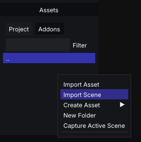
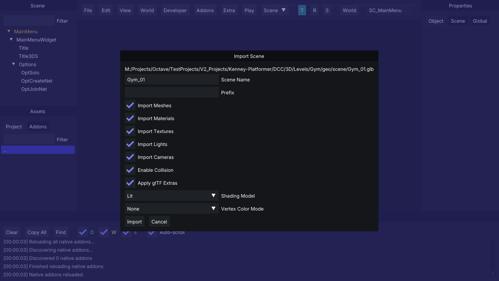

### Overview

- Creates the appropriate node type (`Node3D`, `StaticMesh3D`, or `InstancedMesh3D`)
- Links the referenced project asset (by UUID, then path, then name)
- Applies the specified material type
- Attaches the specified Lua script with property overrides
- Sets the main camera if flagged
- Skips creating redundant mesh/material/texture assets for nodes that reference existing project assets

If no extras are present, nodes default to `StaticMesh3D` (matching pre-extras behavior).

### Reimport Scene

You can Reimport or Refresh your scene with new layout, and textures.

- Right Click the `Assets Panel` area, and select `Import Scene`
- Select the `.glb` file you exported out.
- Set your import settings.
  - If you updated/changed textures on a mesh that doesn't exist in your project assets, toggle the `Textures Updated` checkbox.
- Click `Import` to reimport your scene.
  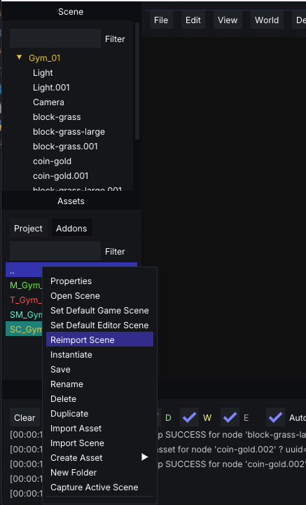
  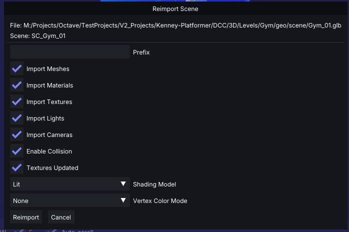

## Compatibility

- **Minimum Blender version:** 3.0
- **Backward compatibility:** Old exports using `instance_mesh` (bool) and `static_mesh` (bool) extras are still recognized by the Editor. `instance_mesh=true` maps to `InstancedMesh`, otherwise `StaticMesh`.
